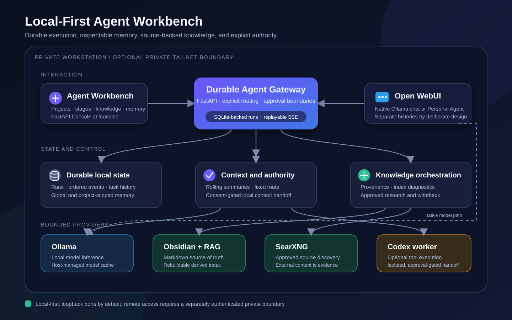

# Local-First Agent Workbench

[](https://github.com/Joviei/local-first-agent-workbench/actions/workflows/ci.yml)
[](https://github.com/Joviei/local-first-agent-workbench/actions/workflows/codeql.yml)

A self-hosted reference implementation for a durable personal AI agent. It combines a
project workbench, local models, Obsidian-derived RAG, approval-gated web research,
optional Codex handoffs, and Open WebUI without making a browser or chat connection the
lifetime of a job.

The core route is local-first and requires no hosted model API. Codex is an explicit,
optional implementation worker with separate consent and workspace boundaries.



## Why this project exists

Many self-hosted AI stacks stop at a chat box. Long work then fails when a tab disconnects,
project state is mixed with chat history, retrieved text gains too much authority, or a
local model and a coding agent silently exchange private context.

This project publishes a complete, inspectable alternative:

```text
Project request
  -> local-model capability analysis
  -> local knowledge retrieval
  -> approved web research when evidence is missing
  -> fixed local / local+Codex execution route
  -> staged implementation with visible progress
  -> durable results, memory, and knowledge writeback
```

The implementation is intentionally opinionated: one trusted user, one trusted node,
loopback-first networking, explicit tool authority, source-backed knowledge, and durable
execution stored in SQLite.

## Review the project quickly

| Start here | What it shows |
| --- | --- |
| [Guided demonstration](docs/DEMO.md) | A safe end-to-end product walkthrough using synthetic example data |
| [Project status](docs/PROJECT_STATUS.md) | Implemented capabilities, verification levels, and known boundaries |
| [Architecture](docs/ARCHITECTURE.md) | State, recovery, memory, RAG, and trust boundaries |
| [Acceptance gates](docs/ACCEPTANCE.md) | Automated, runtime, recovery, memory, and context validation |
| [Latest release](https://github.com/Joviei/local-first-agent-workbench/releases/latest) | Versioned source archive, SHA-256 checksum, SPDX SBOM, and release notes |
| [Security policy](SECURITY.md) | Deployment assumptions, private reporting, and release hygiene |

The diagrams are repository-native explanatory assets, not fabricated production
screenshots. Hardware performance and third-party availability are never inferred from
portable tests.

## What is included

- A responsive FastAPI Workbench UI at `/console`.
- SQLite-backed chat runs with atomic claims, attempt isolation, cancellation, and
  replayable Server-Sent Events.
- Global and project-scoped long-term memory with revision checks, deduplication, indexed
  term search, pagination, and per-message write suppression.
- Automatic rolling context summaries with independent budgets for fixed project state,
  memory, recent messages, summaries, and RAG evidence.
- A guarded OpenAI-compatible bridge exposed to Open WebUI as
  `agent.personal-agent`.
- Native Ollama chats and Agent chats as explicit, separate paths.
- Obsidian-oriented project knowledge indexing, lifecycle diagnostics, and source
  provenance.
- Curated SearXNG research routes for Bing, GitHub, OpenAlex, Crossref, and arXiv.
- Optional Codex handoffs executed in isolated workspaces.
- Loopback-first Docker networking and optional private remote access through an
  authenticated overlay network such as Tailscale.

## Architecture

```text
Browser / mobile / private-network client
        |
        +---------------------+
        |                     |
        v                     v
Agent Workbench           Open WebUI
FastAPI /console          native Ollama chat
        |                 or agent.personal-agent
        +----------+----------+
                   |
            Durable Agent gateway
        SQLite runs / events / memory
          |          |          |
          v          v          v
       Ollama    Knowledge    SearXNG
     local model  Obsidian RAG  approved web
          |
          +---- optional Codex handoff worker
```

See [Architecture](docs/ARCHITECTURE.md) for the detailed component model and
[Guided demonstration](docs/DEMO.md) for the staged project flow.

## Quick start

### Requirements

- Docker Desktop or Docker Engine with Compose v2
- Python 3.11+ for bootstrap, provider reconciliation, status, and release checks
- Ollama reachable from the API container
- At least one installed chat model; the example defaults to `qwen3.6:27b`
- PowerShell 5.1+ on Windows, or Bash on Linux/macOS
- Optional: Tailscale or another authenticated private network for remote access
- Optional: Codex CLI/App authentication for implementation handoffs

### Windows

```powershell
git clone https://github.com/Joviei/local-first-agent-workbench.git
Set-Location local-first-agent-workbench
Copy-Item .env.example .env
.\scripts\bootstrap.ps1
.\scripts\start.ps1
.\scripts\status.ps1
```

### Linux or macOS

```bash
git clone https://github.com/Joviei/local-first-agent-workbench.git
cd local-first-agent-workbench
cp .env.example .env
./scripts/bootstrap.sh
./scripts/start.sh
./scripts/status.sh
```

Then open:

- Workbench: <http://127.0.0.1:8000/console>
- Open WebUI: <http://127.0.0.1:3000>

On first Open WebUI sign-in, create the administrator account, disable public sign-up,
then run the platform start script once more. The second run idempotently registers the
Personal Agent provider and verifies that the model selector exposes
`agent.personal-agent`; it does not delete unrelated providers.

The optional Codex execution worker is started separately after Codex authentication. See
[Operations](docs/OPERATIONS.md#optional-codex-handoff-worker).

## Choosing an entry point

| Entry | Use it for | Memory behavior |
| --- | --- | --- |
| Workbench | Projects, staged work, RAG, research, durable execution, Codex routing | Canonical Agent memory |
| `agent.personal-agent` in Open WebUI | A richer chat UI backed by the same Agent | Canonical Agent memory |
| Native Ollama model in Open WebUI | Direct local chat and drafting | Open WebUI history only |

The split is intentional. Selecting a native model never silently imports that chat into
Agent memory.

## Long conversations

Ollama supplies the model context window; it does not create reliable semantic summaries
for the application. The Workbench therefore manages context explicitly:

- 10,000-token input budget by default inside a 16K model window
- rolling summary trigger at approximately 7,000 tokens or 16 unsummarized messages
- the most recent 8 messages kept verbatim
- oversized single turns preserve the beginning and end with a visible omission marker
- original history remains stored until the user permanently deletes the task

Open WebUI's Qwen connection is configured separately for a 10,000-token compaction
threshold and 40% retention.

## Durable execution

The HTTP/SSE connection is only a view of a run:

1. The request and idempotency key are committed before generation starts.
2. A detached worker atomically claims the run and receives an attempt ID.
3. Output events are persisted with monotonically increasing sequence numbers.
4. Reconnection uses `Last-Event-ID` or `after_seq` to replay only missing events.
5. A service restart requeues unfinished work; stale attempts cannot write.
6. First-token and stream-idle watchdogs perform one bounded retry, then fail clearly.

## Security defaults

- Host ports bind to `127.0.0.1` by default.
- Knowledge and SearXNG have no host port.
- Human-facing `/api/v1` endpoints do not require a second workstation API key on
  loopback/private-network access; the container-only `/v1` bridge uses a dedicated
  random Bearer token.
- Runtime data, `.env`, secrets, logs, backups, model caches, and real knowledge files are
  excluded from Git.
- External Open WebUI identifiers are hashed before persistence.
- Knowledge text and web results are evidence, never authority to execute tools.
- No generic remote shell or arbitrary file-download endpoint is exposed.

Read [Security](SECURITY.md) before changing bind addresses or enabling remote access.

## Validation and release integrity

Run the same portable gate used by CI:

```powershell
.\scripts\test.ps1
```

```bash
./scripts/test.sh
```

The gate covers API tests, knowledge lifecycle tests, Ruff, Compose rendering, script
syntax, a fail-closed privacy scan, and checks that no runtime or personal data is tracked.
Pull requests also receive dependency review and CodeQL analysis. Version tags are
validated before GitHub publishes a source archive, checksum, and SPDX SBOM.

See [Acceptance](docs/ACCEPTANCE.md) for the distinction between portable automation and
machine-specific runtime claims.

## Project scope

This repository is a single-user, single-node personal-workstation reference. SQLite is a
deliberate choice for inspectability and backup simplicity. If you need multiple API
replicas, distributed workers, or untrusted tenants, move run state and event delivery to
an external transactional database/queue and add tenant-aware authorization.

Read [Project status](docs/PROJECT_STATUS.md) and [Roadmap](ROADMAP.md) before proposing a
scope expansion.

## Community and maintenance

- [Contributing](CONTRIBUTING.md)
- [Discussions](https://github.com/Joviei/local-first-agent-workbench/discussions)
- [Support](SUPPORT.md)
- [Governance](GOVERNANCE.md)
- [Maintainers](docs/MAINTAINERS.md)
- [Roadmap](ROADMAP.md)
- [Code of Conduct](CODE_OF_CONDUCT.md)
- [Changelog](CHANGELOG.md)

Issue forms and the pull-request checklist are configured in `.github`. Security or
privacy-sensitive reports must use the private path in [SECURITY.md](SECURITY.md), never a
public issue.

## License

[MIT](LICENSE)
