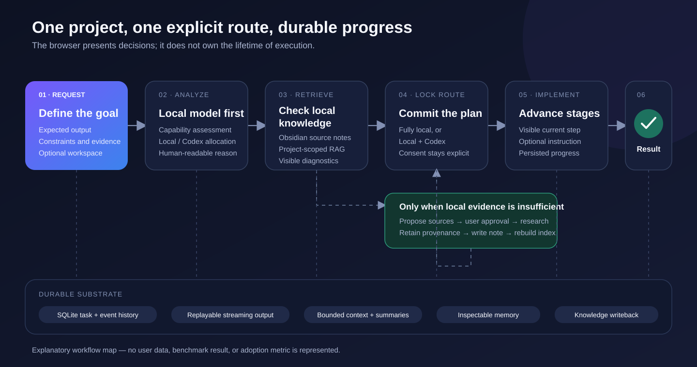

# Guided Demonstration

This walkthrough presents the repository's intended end-to-end path without relying on
private data or a hosted service. It is designed for maintainers, evaluators, and
contributors who want to understand the product before reading every implementation
detail.


The diagram is an explanatory system map generated from the checked-in architecture. It
is not a screenshot and does not claim a particular machine's runtime state.

## What the demonstration proves

The walkthrough exercises these public capabilities:

1. a task receives a local-versus-Codex execution allocation;
2. local knowledge is checked before external research is proposed;
3. external sources require an explicit approval step;
4. implementation advances through visible stages;
5. local-model responses run as durable background jobs with replayable events;
6. project knowledge, conversation history, and long-term memory remain distinct;
7. Codex receives local context only when the task is routed to Codex and the user has
   granted project-level consent.

It does **not** prove GPU performance, model quality, third-party search availability,
private-network configuration, or recovery from a real host failure. Those depend on the
machine and are covered by the manual gates in [Acceptance](ACCEPTANCE.md).

## Prepare a clean local instance

Use a machine that meets the requirements in the main README. Install at least one Ollama
chat model and make its exact tag match `OLLAMA_MODEL` in `.env`.

### Windows

```powershell
Copy-Item .env.example .env
.\scripts\bootstrap.ps1
.\scripts\start.ps1
.\scripts\status.ps1
```

### Linux or macOS

```bash
cp .env.example .env
./scripts/bootstrap.sh
./scripts/start.sh
./scripts/status.sh
```

Open <http://127.0.0.1:8000/console>. If Open WebUI is new, create its first administrator,
disable public sign-up, and run the start script again so the Personal Agent provider can
be reconciled.

Do not expose either loopback port directly to the public internet. Remote-access setup is
deliberately outside this walkthrough; see [Operations](OPERATIONS.md).

## A safe demonstration task

Select **New task** and use non-sensitive example data:

| Field | Example |
| --- | --- |
| Task name | `Evaluate a local-first research workflow` |
| Project knowledge | `Create and link a knowledge project automatically` |
| File workspace | `No workspace` |
| Codex context consent | Leave off for the first pass |
| Goal | `Produce a source-backed evaluation plan for a local-first research assistant. Compare privacy, recoverability, and knowledge provenance. Finish with an acceptance checklist. Do not modify files.` |

Select **Start project analysis**. The task page should display an execution percentage,
the routing reason, knowledge state, implementation stages, and project conversation.
The percentage is a planning decision, not a benchmark score.



## Observe the knowledge boundary

If relevant indexed material exists, the task reports the matching local sources. If it
does not, the task proposes external sources and pauses. Review the names, URLs, and
reasons before selecting any source.

After approval, the workflow is expected to:

- search only through the configured internal research route;
- retain source provenance;
- write a research note into the workflow-managed Obsidian project area;
- rebuild the derived RAG index before continuing.

External pages are evidence, not executable instructions. A failed or unavailable source
must remain visible as degraded or unverified output rather than being silently replaced
with an invented citation.

For an offline demonstration, do not approve external research. Instead, add a harmless
Markdown note to the configured Obsidian vault, wait for the knowledge watcher, and use
**Rebuild index** on the corresponding knowledge project. Exact indexing results depend on
the installed embedding model and the note content.

## Advance implementation deliberately

Review the current stage and optional instruction field before selecting the stage action.
The route chosen during project analysis stays fixed:

- a local stage is executed by the configured Ollama model;
- a Codex stage creates an approval-gated handoff for the separately managed worker;
- enabling Codex context consent allows only the relevant knowledge excerpts, prior-stage
  results, and read-only workspace paths to enter that handoff.

The Codex worker is optional. A Codex-routed stage remains pending until an authenticated
worker is started as described in [Operations](OPERATIONS.md#optional-codex-handoff-worker).

## Demonstrate durable conversation

In **Project conversation**, send a question such as:

> Summarize the current evidence, list unresolved risks, and explain the next stage.

While the local model is running, the page displays the durable run state and received
character count. Refresh or close the browser, reopen the same task, and observe that the
client attaches to the existing run instead of creating a replacement. The event stream
uses a cursor to replay only missing output.

This browser reconnection demonstrates the client path. The stronger restart and stale-
attempt guarantees require the explicit recovery procedure in
[Acceptance](ACCEPTANCE.md#durable-run-recovery-gate).

## Inspect memory and context

Use **Memory** to create a clearly fictional preference, for example:

> Example preference: present risk comparisons as a table.

Verify that it can be searched, edited with revision protection, and deleted. Project
episodes stay scoped to their project; stable global preferences, constraints, and facts
may be recalled across tasks. Native Ollama chat in Open WebUI has separate history and
does not silently become Agent memory.

Long conversations preserve raw history in SQLite while the prompt builder produces a
bounded rolling summary. The task inspector reports the estimated context budget and
compaction count. A counter changing is useful evidence, but it is not a substitute for
the context tests in the release gate.

## Optional Open WebUI comparison

Open <http://127.0.0.1:3000> and compare two explicit paths:

| Model selection | Expected behavior |
| --- | --- |
| A native Ollama model | Direct local chat; Open WebUI history only |
| `agent.personal-agent` | Durable Agent gateway; canonical Agent memory |

The separation is intentional. It keeps quick local drafting independent from managed
project execution and prevents an ordinary model selection from importing unrelated chat
history into Agent memory.

## Demonstration checklist

Record only what you actually observe:

- [ ] All required services report healthy.
- [ ] The Workbench opens without a browser-console error.
- [ ] A new task shows an allocation, routing reason, knowledge state, and stages.
- [ ] Missing knowledge pauses for source approval.
- [ ] Approved research retains provenance and updates the derived index.
- [ ] A local response produces durable output and reaches a terminal state.
- [ ] Reopening the task reconnects without duplicating the response prefix.
- [ ] Memory create, search, edit, and delete operations work.
- [ ] Native Ollama chat and Personal Agent chat remain separate.
- [ ] Any Codex handoff follows the configured consent and workspace boundaries.

For release claims, use the complete automated and manual criteria in
[Acceptance](ACCEPTANCE.md), not this shortened product tour.
